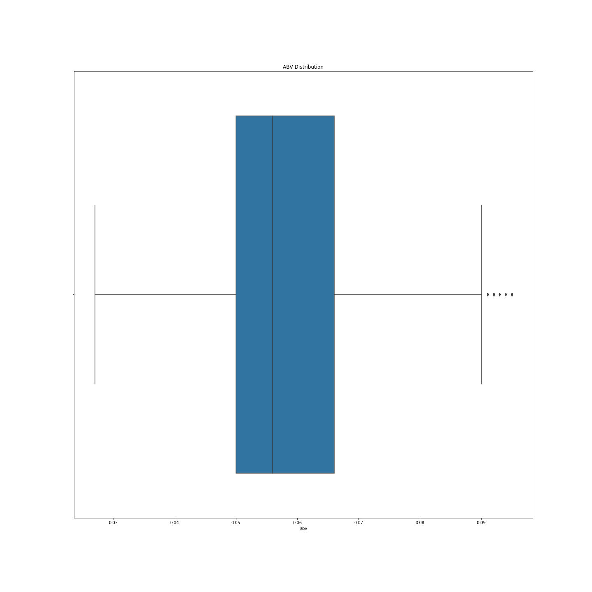
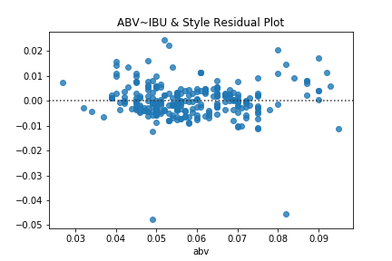

# Predicting ABV in Craft Beers
Maura Cerow

## Introduction

This project aims to predict the ABV level in a given craft beer using linear regression. The data was found on [kaggle](https://www.kaggle.com/neuromusic/avocado-prices/data).

The libraries used include:

    - NumPy
    - Pandas
    - Matplotlib
    - Seaborn
    - Sklearn
    - Scipy
    - Statsmodels

In this repo you will find my jupyter notebook, csv file from kaggle and folder for images of visualizations made.

## Data Cleaning & Modeling

    see: Blog3.ipynb
    
After reading in my data, I wanted to check the distribution of my target variable which in this case is ABV level.

I have some outliers in my data, so I want to drop those. I use my interquartile range to cut outliers on both ends of my dataset.

Now that I have my clean data, I checked for correlation between my target variables and the features I'll be using in modeling. IBU has the highest correlation with ABV at .65.

### Modeling & Evaluation

I ran my first model just looking at the style - IPA vs Pilnser and so on. My first model returned an R-Squared value of .499 and my RMSE is 0.043. I know looking at my correlation matrix, I have to strongest correlation between ABV & IBU. When I run a linear regression model with IBU as my feature to predict ABV, my R-Squared value improves to 0.819 and my RMSE dropped to 0.024. I already have a more accurate model, but when predicting, the more features the better. I decided to run a third model that used both style & IBU as features. This third model returned an R-Squared value of .987 and the test RMSE is 0.009.

When I look at my residual plot for my third model, I see my points hover around 0. The window is tight and I can proceed with this model as my best one.

## Blog Link

I wrote up a blog for this project found [here](https://medium.com/swlh/predicting-abv-levels-in-craft-beer-9366616d817).
